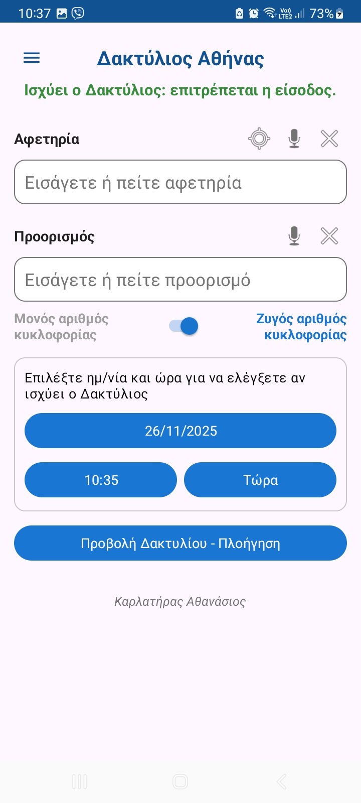
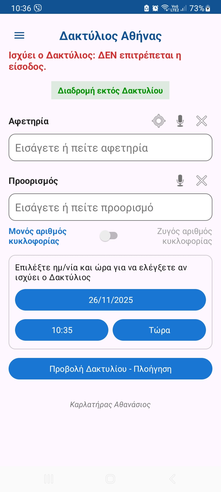
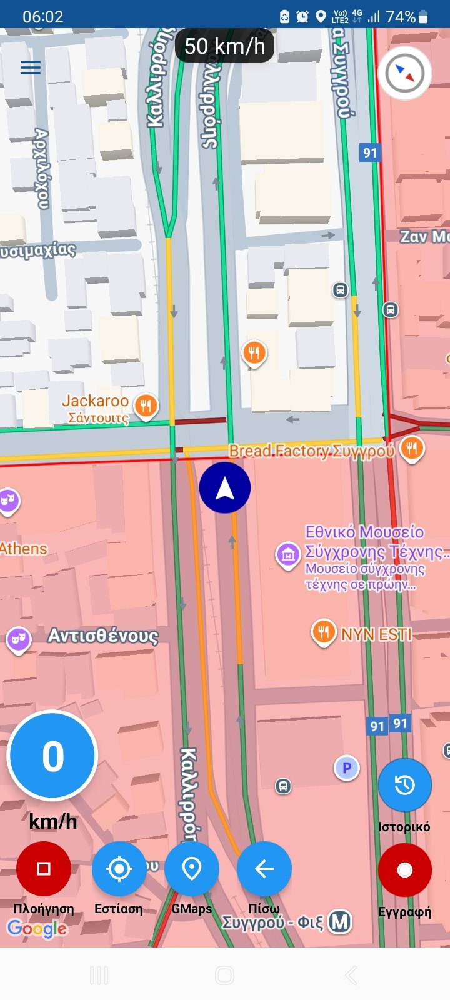

# AthensRingHelper

Android application that helps drivers navigate the Athens Ring ("Δακτύλιος") by automatically checking whether entry is allowed based on:

- Odd/Even license plate rule  
- Date & time restrictions  
- User's preferences  
- Polygon-based geofencing  
- Real-time map validation  
- Google Places Autocomplete & voice input  
- Route preview (inside or outside the Ring)  
- Real-time notifications when approaching or entering the Ring  

---

## 📲 Download

👉 **Download the latest APK:**  
[app-release.apk](https://github.com/a-karlatiras/AthensRingHelper/releases/latest/download/app-release.apk)

---

## 📸 Screenshots

  
  
  

  
  
  

---

# 🇬🇷 Περιγραφή στα Ελληνικά

Η εφαρμογή **AthensRingHelper** (**Δακτύλιος Αθήνας**) βοηθά τους οδηγούς να γνωρίζουν εάν επιτρέπεται η είσοδος εντός του Δακτυλίου με βάση:

- Μονός/ζυγός αριθμός κυκλοφορίας  
- Ημερομηνία & ώρα  
- Προσωπικές ρυθμίσεις χρήστη  
- Πολυγωνική ζώνη του Δακτυλίου  
- Έλεγχο διεύθυνσης (εντός/εκτός Δακτυλίου)  
- Σχεδιασμό βέλτιστης διαδρομής  
- Αποφυγή της ζώνης όταν δεν επιτρέπεται η είσοδος  
- Πλοήγηση σε πραγματικό χρόνο με προειδοποιήσεις. Ορισμός της διαδρομής πριν την πλοήγηση  

Η εφαρμογή **δεν παρέχει φωνητική καθοδήγηση**, αλλά εμφανίζει οπτικά μηνύματα όταν:

- Το όχημα προσεγγίζει τα όρια του Δακτυλίου  
- Το όχημα εισέρχεται στον Δακτύλιο ενώ δεν επιτρέπεται  
- Η βέλτιστη διαδρομή περνά εντός ή εκτός Δακτυλίου  

---

## 🔐 Permissions Used

Η εφαρμογή χρησιμοποιεί τα παρακάτω δικαιώματα:

- **Location (Fine & Coarse)** – για εύρεση θέσης και έλεγχο εισόδου στον Δακτύλιο  
- **Internet access** – για Google Maps, Places Autocomplete και υπολογισμό διαδρομής  
- **Microphone (optional)** – χρησιμοποιείται μόνο όταν ο χρήστης ενεργοποιεί τη φωνητική αναζήτηση  

Η εφαρμογή **δεν συλλέγει, αποθηκεύει ή μεταφέρει προσωπικά δεδομένα**.

---

## 📌 Features

- Google Maps integration  
- Route optimization  
- Ring zone polygon (GeoJSON)  
- Real-time location monitoring  
- Voice input (Google Speech-to-Text)  
- Automatic date/time simulation  
- Odd/Even parity logic  

---

## 🛠️ Technologies Used

- Kotlin  
- Google Maps SDK  
- Google Places API  
- GeoJSON processing  
- Material Components  

---

## 📄 License

This project is licensed under the **MIT License**.  
See the full license in the [`LICENSE`](LICENSE) file.

---

## © Credits

Developed by **Αθανάσιος Καρλατήρας**
